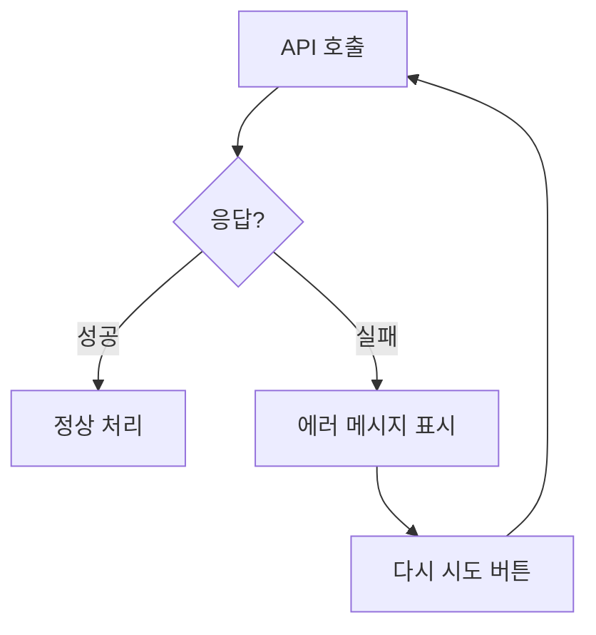

# 유저 플로우 (User Flows)

> 각 기능별 사용자 관점 플로우를 Mermaid 다이어그램으로 시각화

---

## 1. 인증 플로우

### 1.1 신규 가입 (초대 코드 + Magic Link)

```mermaid
flowchart TD
    A[앱 접속] --> B{세션 존재?}
    B -->|Yes| C{프로필 존재?}
    B -->|No| D[/invite 리다이렉트]

    C -->|Yes| E[/ 홈]
    C -->|No| F[/onboarding]

    D --> G[초대 코드 입력]
    G --> H{코드 유효?}
    H -->|No| I[에러: 유효하지 않은 코드]
    H -->|Yes| J[/login 이메일 입력]

    J --> K[Magic Link 이메일 발송]
    K --> L[이메일 확인 + 링크 클릭]
    L --> M[/auth/callback]
    M --> N{첫 로그인?}
    N -->|Yes| F
    N -->|No| E

    F --> O[닉네임 입력 2~12자]
    O --> P[profiles 테이블 INSERT]
    P --> E
```

### 1.2 재방문 로그인

```mermaid
flowchart TD
    A[앱 접속] --> B{세션 유효?}
    B -->|Yes| C[/ 홈 바로 표시]
    B -->|No, 만료| D[/invite 리다이렉트]
    D --> E[초대 코드 입력 or /login]
    E --> F[Magic Link 재발송]
```

---

## 2. 기록 작성 플로우

### 2.1 일반 기록 (직접 입력)

```mermaid
flowchart TD
    A[하단 + 버튼 클릭] --> B[/record/new]
    B --> C[도서 검색 다이얼로그]
    C --> D[검색어 입력]
    D --> E[/api/books/search 호출]
    E --> F{books 캐시 존재?}
    F -->|Yes| G[DB에서 반환]
    F -->|No| H[네이버 API 호출]
    H --> I[books 테이블 저장]
    I --> G
    G --> J[검색 결과 표시]
    J --> K[책 선택]

    K --> L[기록 입력 폼]
    L --> M[상태 선택: 읽는중/완독/읽고싶은]
    L --> N[별점 1~5 선택 선택적]
    L --> O[감상 입력 선택적]
    L --> P[인용구 입력 선택적]
    L --> Q[카드 배경색 선택]

    M --> R{저장 클릭}
    N --> R
    O --> R
    P --> R
    Q --> R

    R --> S[records 테이블 INSERT]
    S --> T[/ 홈 리다이렉트]
    T --> U[기록 카드 표시]
```

### 2.2 대화형 기록 (AI 인터뷰)

```mermaid
flowchart TD
    A[기록 작성 화면] --> B[AI 인터뷰 버튼 클릭]
    B --> C[InterviewChat 컴포넌트 열림]

    C --> D[/api/agent/interview POST]
    D --> E[SSE 스트리밍 시작]
    E --> F[AI 질문 1 표시]

    F --> G[사용자 답변 입력]
    G --> H[AI 질문 2~3]
    H --> I[사용자 답변]

    I --> J{3턴 이상?}
    J -->|Yes| K[정리하기 버튼 표시]
    J -->|No| L[대화 계속]
    L --> H

    K --> M[/api/agent/summarize POST]
    M --> N[AI가 대화 요약 생성]
    N --> O[기록 폼에 자동 입력]
    O --> P[사용자 수정]
    P --> Q[저장]
```

---

## 3. 기록 조회/수정/삭제 플로우

### 3.1 기록 상세 및 액션

```mermaid
flowchart TD
    A[홈 기록 카드 클릭] --> B[/record/id 상세]
    B --> C[기록 내용 표시]
    C --> D{사용자 액션}

    D -->|수정| E[/record/id/edit]
    E --> F[기존 내용 로드]
    F --> G[수정 → 저장]
    G --> H[records UPDATE]
    H --> B

    D -->|삭제| I[삭제 확인 다이얼로그]
    I -->|확인| J[records DELETE]
    J --> K[/ 홈 리다이렉트]
    I -->|취소| B
```

---

## 4. 독서 모임 플로우

### 4.1 모임 생성

```mermaid
flowchart TD
    A[/groups 모임 목록] --> B[모임 만들기 버튼]
    B --> C[/groups/new]
    C --> D[모임 만들기 탭]

    D --> E[모임명 입력]
    E --> F[설명 입력 선택적]
    F --> G[만들기 클릭]

    G --> H[reading_groups INSERT]
    H --> I[group_members INSERT admin 역할]
    I --> J[모임 초대 코드 생성]
    J --> K[/groups/id 모임 상세]
```

### 4.2 모임 가입 (초대 코드)

```mermaid
flowchart TD
    A[/groups/new] --> B[모임 참여 탭]
    B --> C[초대 코드 입력]
    C --> D{코드 유효?}

    D -->|No| E[에러: 모임을 찾을 수 없어요]
    D -->|Yes| F{이미 멤버?}

    F -->|Yes| G[이미 가입된 모임]
    F -->|No| H[group_members INSERT member 역할]
    H --> I[/groups/id 모임 상세]
```

### 4.3 세션 생성 및 후기

```mermaid
flowchart TD
    A[모임 상세] --> B[세션 추가 버튼]
    B --> C[/groups/id/sessions/new]

    C --> D[날짜 선택]
    D --> E[도서 검색 → 선택]
    E --> F[세션 추가 클릭]
    F --> G[sessions INSERT]
    G --> H[모임 상세로 돌아감]

    H --> I[세션 카드 클릭]
    I --> J[/groups/id/sessions/sessionId]

    J --> K{사용자 액션}
    K -->|감상 작성| L[감상 텍스트 + 별점 입력]
    L --> M[session_reviews INSERT]

    K -->|AI 활용| N[AgentPanel 열기]
    N --> O[토론 주제 / 발제문 / 분석 탭]
```

---

## 5. AI 에이전트 플로우

### 5.1 도서 분석 (캐싱 포함)

```mermaid
flowchart TD
    A[세션 상세 AI 패널] --> B[분석 탭 클릭]
    B --> C{ai_contents 캐시?}

    C -->|있음| D[DB에서 즉시 반환]
    C -->|없음| E[/api/agent/analysis POST]

    E --> F[Sonnet 4.5 호출]
    F --> G[분석 결과 생성]
    G --> H[ai_contents INSERT 캐싱]
    H --> D

    D --> I[분석 결과 표시]
    I --> J[핵심 논점 + 요약 + 추천 도서]
```

### 5.2 토론 주제 생성

```mermaid
flowchart TD
    A[AI 패널 토론주제 탭] --> B[/api/agent/topics POST]
    B --> C[SSE 스트리밍 시작]
    C --> D[토론 주제 실시간 표시]
    D --> E[5개 주제 완성]
    E --> F[사용자가 모임에서 활용]
```

---

## 6. 에러 처리 플로우

### 6.1 네트워크 에러



### 6.2 인증 만료

```mermaid
flowchart TD
    A[보호된 페이지 접근] --> B{세션 유효?}
    B -->|Yes| C[정상 표시]
    B -->|No| D[미들웨어에서 감지]
    D --> E[/invite 리다이렉트]
    E --> F[재로그인]
```

---

## 7. 하단 탭 네비게이션

```mermaid
flowchart LR
    HOME[홈 내 기록] --- SEARCH[검색]
    SEARCH --- RECORD[+ 기록]
    RECORD --- GROUPS[모임]
    GROUPS --- PROFILE[프로필]

    HOME --> A[/ 최근 기록 타임라인]
    SEARCH --> B[/search 도서 검색]
    RECORD --> C[/record/new 기록 작성]
    GROUPS --> D[/groups 모임 목록]
    PROFILE --> E[/profile 프로필 + 통계]
```
